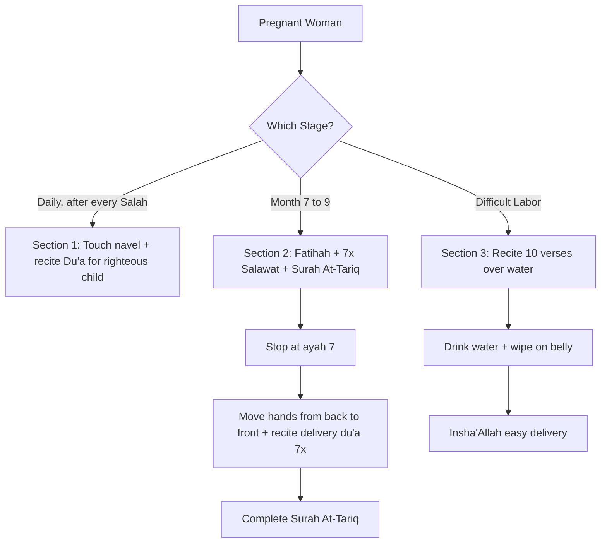

# DOA UNTUK HAMIL
## (Prayers for Pregnancy) — Complete Line-by-Line Guide

---

# 📖 OVERVIEW

This is a traditional compilation of supplications (du'ā) recited by Muslim women during and around pregnancy, found commonly in Malay/Indonesian Islamic prayer manuals (kitab doa). It contains **three distinct sections**:

1. **Doa Setiap Lepas Sholat** — A daily du'ā recited after every prayer while touching the navel, asking Allah for a righteous child.
2. **Doa Bulan Ketujuh Hingga Sembilan** — Recitations from month 7–9 of pregnancy, including Surah At-Tāriq and a du'ā for safe delivery.
3. **Doa Terhalang Kelahiran (Du'ā ʿUsr al-Wilādah)** — Qur'ānic verses recited over water for women facing difficult labor.

> ⚠️ **Source Note:** These compilations are **folk-tradition prayers** circulated in Malay/Indonesian/Yemeni prayer manuals (likely from the Ḥaḍramī tradition or popular kitab kuning compilations). They are **NOT directly traced to authentic hadith** (Bukhārī, Muslim, etc.). The embedded Qur'ānic verses ARE authentic. The composed du'ās themselves are pious supplications — permissible to recite as personal prayers, but should not be attributed to the Prophet ﷺ. See "Sources & Authenticity" at the end.

---

# 🟢 SECTION 1: DOA SETIAP LEPAS SHOLAT
## (Du'ā After Every Prayer)

### 📋 Instructions (Indonesian → English)

| Malay/Indonesian | English |
|---|---|
| Setiap lepas sholat | After every (obligatory) prayer |
| Sambil memegang pusar | While holding/touching the navel |
| Baca do'a ini | Recite this du'ā |

---

### 🌙 The Full Du'ā — Arabic

> اَللَّهُمَّ إِنْ كُنْتَ خَلَقْتَ خَلْقاً فِي بَطْنِي هَذَا فَكَوِّنْهُ ذَكَراً وَصَوِّرْهُ صُورَةً جَمِيلَةً كَامِلاً وَاجْعَلْهُ رَجُلاً صَالِحاً عَالِماً عَاقِلاً مُطِيعاً لِلَّهِ تَعَالَى وَلِرَسُولِهِ ﷺ وَلِوَالِدَيْهِ، وَمِنَ الْمَرْزُوقِينَ رِزْقاً حَلَالاً طَيِّباً مُبَارَكاً وَاسِعاً، وَاحْفَظْهُ مِنَ الْفَضِيحَتَيْنِ: الْفَقْرِ وَالدَّيْنِ، وَسَلِّمْهُ مِنْ آفَاتِ الدُّنْيَا وَالآخِرَةِ وَفِتْنَتِهِمَا. اَللَّهُمَّ لَا تَجْعَلْهُ مِنْ أَهْلِ الضَّيْرِ، وَاهْدِنَا الصِّرَاطَ الْمُسْتَقِيمَ، صِرَاطَ الَّذِينَ أَنْعَمْتَ عَلَيْهِمْ غَيْرِ الْمَغْضُوبِ عَلَيْهِمْ وَلَا الضَّالِّينَ، آمِينَ بِرَحْمَتِكَ يَا أَرْحَمَ الرَّاحِمِينَ، وَالْحَمْدُ لِلَّهِ رَبِّ الْعَالَمِينَ. ﴿رَبِّ لَا تَذَرْنِي فَرْداً وَأَنْتَ خَيْرُ الْوَارِثِينَ﴾

---

### 🔤 Word-by-Word Breakdown

| # | Arabic | Transliteration | Meaning |
|---|---|---|---|
| 1 | اَللَّهُمَّ | Allāhumma | O Allah |
| 2 | إِنْ كُنْتَ | in kunta | if You have |
| 3 | خَلَقْتَ | khalaqta | created |
| 4 | خَلْقاً | khalqan | a creation |
| 5 | فِي بَطْنِي هَذَا | fī baṭnī hādhā | in this womb of mine |
| 6 | فَكَوِّنْهُ | fa-kawwinhu | then make it |
| 7 | ذَكَراً | dhakaran | male |
| 8 | وَصَوِّرْهُ | wa-ṣawwirhu | and shape it |
| 9 | صُورَةً جَمِيلَةً | ṣūratan jamīlatan | a beautiful form |
| 10 | كَامِلاً | kāmilan | complete/whole |
| 11 | وَاجْعَلْهُ | wa-jʿalhu | and make him |
| 12 | رَجُلاً صَالِحاً | rajulan ṣāliḥan | a righteous man |
| 13 | عَالِماً | ʿāliman | knowledgeable |
| 14 | عَاقِلاً | ʿāqilan | wise/intelligent |
| 15 | مُطِيعاً | muṭīʿan | obedient |
| 16 | لِلَّهِ تَعَالَى | lillāhi taʿālā | to Allah Most High |
| 17 | وَلِرَسُولِهِ | wa-li-rasūlihi | and to His Messenger ﷺ |
| 18 | وَلِوَالِدَيْهِ | wa-li-wālidayhi | and to his parents |
| 19 | وَمِنَ الْمَرْزُوقِينَ | wa mina-l-marzūqīn | and from those provided for |
| 20 | رِزْقاً حَلَالاً | rizqan ḥalālan | with lawful provision |
| 21 | طَيِّباً | ṭayyiban | good/pure |
| 22 | مُبَارَكاً | mubārakan | blessed |
| 23 | وَاسِعاً | wāsiʿan | abundant |
| 24 | وَاحْفَظْهُ | wa-ḥfaẓhu | and protect him |
| 25 | مِنَ الْفَضِيحَتَيْنِ | mina-l-faḍīḥatayn | from the two disgraces |
| 26 | الْفَقْرِ وَالدَّيْنِ | al-faqri wa-d-dayn | poverty and debt |
| 27 | وَسَلِّمْهُ | wa-sallimhu | and keep him safe |
| 28 | مِنْ آفَاتِ الدُّنْيَا وَالآخِرَةِ | min āfāti-d-dunyā wa-l-ākhirah | from the calamities of this world and the next |
| 29 | وَفِتْنَتِهِمَا | wa-fitnatihimā | and their trials |
| 30 | لَا تَجْعَلْهُ | lā tajʿalhu | do not make him |
| 31 | مِنْ أَهْلِ الضَّيْرِ | min ahli-ḍ-ḍayr | from the people of harm |
| 32 | وَاهْدِنَا | wa-hdinā | and guide us |
| 33 | الصِّرَاطَ الْمُسْتَقِيمَ | aṣ-ṣirāṭa-l-mustaqīm | the straight path |
| 34 | آمِينَ | āmīn | Amen |
| 35 | بِرَحْمَتِكَ | bi-raḥmatika | by Your mercy |
| 36 | يَا أَرْحَمَ الرَّاحِمِينَ | yā arḥama-r-rāḥimīn | O Most Merciful of those who show mercy |
| 37 | رَبِّ لَا تَذَرْنِي فَرْداً | Rabbi lā tadharnī fardan | My Lord, do not leave me alone |
| 38 | وَأَنْتَ خَيْرُ الْوَارِثِينَ | wa anta khayru-l-wārithīn | and You are the best of inheritors |

---

### 📜 Full English Translation

> *"O Allah, if You have created a being in this womb of mine, then form it as a male, and shape it in a beautiful, complete form. Make him a righteous man — knowledgeable, wise, obedient to Allah Most High, to His Messenger ﷺ, and to his parents. Make him among those granted lawful, pure, blessed, and abundant provision. Protect him from the two disgraces — poverty and debt. Keep him safe from the calamities and trials of this world and the next. O Allah, do not make him among the people of harm, and guide us to the straight path — the path of those You have favored, not of those who incurred Your anger nor of those who went astray. Āmīn, by Your mercy, O Most Merciful of those who show mercy. All praise is for Allah, Lord of the worlds. ‘My Lord, do not leave me alone, and You are the best of inheritors.'"*

> 💡 The closing verse is **Qur'ān 21:89** — the du'ā of Prophet Zakariyyā (AS) asking Allah for offspring.

---

# 🟢 SECTION 2: DOA BULAN KETUJUH HINGGA SEMBILAN
## (From the 7th to 9th Month of Pregnancy)

### 📋 Instructions

| Malay/Indonesian | English |
|---|---|
| Dari bulan ketujuh sampai sembilan | From the 7th to the 9th month |
| Baca surat Al-Fātiḥah | Recite Sūrah Al-Fātiḥah |
| Lalu shalawat kepada Nabi (اللهم صل على سيدنا محمد) 7 kali atau lebih | Then salutations upon the Prophet (Allāhumma ṣalli ʿalā sayyidinā Muḥammad) 7 times or more |
| Lalu baca surat At-Tāriq | Then recite Sūrah At-Tāriq |
| (تضع يديها على بطنها من فوق السرة وتنزل يدها بخفة إلى موضع فرجها) | (She places her hands on her belly above the navel and slides them gently down toward her private area) |
| Vacaan dilakukan 7 kali | Performed 7 times |

---

### 📖 Sūrah At-Tāriq (Qur'ān 86:1–7)

**Bismillāhi-r-Raḥmāni-r-Raḥīm** — In the name of Allah, the Most Gracious, the Most Merciful.

| Ayah | Arabic | Transliteration | Translation |
|---|---|---|---|
| 1 | وَالسَّمَاءِ وَالطَّارِقِ | Wa-s-samāʾi wa-ṭ-ṭāriq | By the sky and the night-comer |
| 2 | وَمَا أَدْرَاكَ مَا الطَّارِقُ | Wa mā adrāka ma-ṭ-ṭāriq | And what will make you know what the night-comer is? |
| 3 | النَّجْمُ الثَّاقِبُ | An-najmu-th-thāqib | The piercing star |
| 4 | إِنْ كُلُّ نَفْسٍ لَمَّا عَلَيْهَا حَافِظٌ | In kullu nafsin lammā ʿalayhā ḥāfiẓ | There is no soul but has a protector over it |
| 5 | فَلْيَنْظُرِ الْإِنْسَانُ مِمَّ خُلِقَ | Fa-l-yanẓuri-l-insānu mimma khuliq | So let man observe from what he was created |
| 6 | خُلِقَ مِنْ مَاءٍ دَافِقٍ | Khuliqa min māʾin dāfiq | He was created from a gushing fluid |
| 7 | يَخْرُجُ مِنْ بَيْنِ الصُّلْبِ وَالتَّرَائِبِ | Yakhruju min bayni-ṣ-ṣulbi wa-t-tarāʾib | Emerging from between the backbone and the ribs |

> **STOP at ayah 7**, then recite the du'ā below while moving the hands from the lower back forward around the belly down toward the pelvis.

---

### 🌙 Du'ā for Safe Delivery (Recite 7 Times)

#### Arabic

> اَللَّهُمَّ أَخْرِجْ هَذَا الْمَوْلُودَ فِي بَطْنِي مِنْ فَرْجِي فِي وَقْتِ وِلَادَتِي سَالِماً وَسَعِيداً فِي الدُّنْيَا وَالآخِرَةِ. يَا حَنَّا وَلَدَتْ مَرْيَمَ، وَمَرْيَمُ وَلَدَتْ عِيسَى، أُخْرُجْ أَيُّهَا الْمَوْلُودُ بِقُدْرَةِ الْمَلِكِ الْمَعْبُودِ. اَللَّهُمَّ تَقَبَّلْ دُعَائِي كَمَا تَقَبَّلْتَ دُعَاءَ سَيِّدِنَا وَشَفِيعِنَا مُحَمَّدٍ ﷺ بِرَحْمَتِكَ يَا أَرْحَمَ الرَّاحِمِينَ، وَالْحَمْدُ لِلَّهِ رَبِّ الْعَالَمِينَ. اَللَّهُمَّ الْطُفْ فِي تَيْسِيرِ كُلِّ عَسِيرٍ، وَأَسْأَلُكَ الْيُسْرَ وَالْمُعَافَاةَ فِي الدُّنْيَا وَالآخِرَةِ.

#### Word-by-Word

| # | Arabic | Transliteration | Meaning |
|---|---|---|---|
| 1 | اَللَّهُمَّ | Allāhumma | O Allah |
| 2 | أَخْرِجْ | akhrij | bring out |
| 3 | هَذَا الْمَوْلُودَ | hādhā-l-mawlūd | this newborn |
| 4 | فِي بَطْنِي | fī baṭnī | in my womb |
| 5 | مِنْ فَرْجِي | min farjī | from my birth canal |
| 6 | فِي وَقْتِ وِلَادَتِي | fī waqti wilādatī | at the time of my delivery |
| 7 | سَالِماً | sāliman | safely |
| 8 | وَسَعِيداً | wa saʿīdan | and happily |
| 9 | فِي الدُّنْيَا وَالآخِرَةِ | fi-d-dunyā wa-l-ākhirah | in this world and the next |
| 10 | يَا حَنَّا | yā Ḥannā | O Hannah (mother of Maryam) |
| 11 | وَلَدَتْ مَرْيَمَ | waladat Maryam | who gave birth to Maryam |
| 12 | وَمَرْيَمُ وَلَدَتْ عِيسَى | wa Maryamu waladat ʿĪsā | and Maryam who gave birth to ʿĪsā (Jesus) |
| 13 | أُخْرُجْ أَيُّهَا الْمَوْلُودُ | ukhruj ayyuha-l-mawlūd | come out, O newborn |
| 14 | بِقُدْرَةِ الْمَلِكِ الْمَعْبُودِ | bi-qudrati-l-maliki-l-maʿbūd | by the power of the King who is worshipped |
| 15 | تَقَبَّلْ دُعَائِي | taqabbal duʿāʾī | accept my supplication |
| 16 | الْطُفْ فِي تَيْسِيرِ كُلِّ عَسِيرٍ | alṭuf fī taysīri kulli ʿasīr | be gentle in easing every difficulty |
| 17 | الْيُسْرَ وَالْمُعَافَاةَ | al-yusra wa-l-muʿāfāh | ease and well-being |

#### Full English Translation

> *"O Allah, bring forth this child in my womb from my birth canal, at the time of my delivery, safely and happily — in this world and the next. O Hannah who gave birth to Maryam, and Maryam who gave birth to ʿĪsā — come out, O newborn, by the power of the King who is worshipped. O Allah, accept my supplication as You accepted the supplication of our master and intercessor Muḥammad ﷺ, by Your mercy, O Most Merciful of those who show mercy. All praise is for Allah, Lord of the worlds. O Allah, be gentle in easing every difficulty, and I ask You for ease and well-being in this world and the next."*

> Then complete the rest of Sūrah At-Tāriq (verses 8–17).

> ⚠️ **Important Note on Authenticity:** The invocation of "Yā Ḥannā waladat Maryam, wa Maryam waladat ʿĪsā" is a **folk supplication** popular in Yemeni/Ḥaḍramī and Southeast Asian midwifery traditions. It is **not from authentic hadith**. Many scholars consider direct address to deceased persons (like Ḥannā/Maryam) for assistance to be controversial. Reciting just the Qur'ānic verses and the parts addressed directly to Allah is safer.

---

# 🟢 SECTION 3: DOA TERHALANG KELAHIRAN
## (Du'ā ʿUsr al-Wilādah — For Difficult Labor)

### 📋 Instructions

| Malay/Indonesian | English |
|---|---|
| Jika terhalang kelahiran perempuan | If a woman has obstructed labor |
| Baca ayat-ayat dan Surat Al-Zalzalah dalam air | Recite these verses and Sūrah Al-Zalzalah over water |
| Kemudian minum perempuan itu | Then have the woman drink it |
| Dan membersihkannya ke perut | And wipe/wash it onto her belly |
| Dia berkelulusan kanak-kanak dengan mudah, Insya-Allah | She will deliver the child easily, God willing |
| Telah bereksperimen dan manfaat oleh Allah | This has been tested and is beneficial by Allah |

---

### 📖 The Ten Verses to Recite Over Water

#### 1. **Sūrah Ar-Raʿd 13:8**
> اللَّهُ يَعْلَمُ مَا تَحْمِلُ كُلُّ أُنْثَىٰ وَمَا تَغِيضُ الْأَرْحَامُ وَمَا تَزْدَادُ ۖ وَكُلُّ شَيْءٍ عِنْدَهُ بِمِقْدَارٍ

**Translation:** *"Allah knows what every female bears, and what the wombs lose [prematurely] or exceed. And everything with Him is by due measure."*

---

#### 2. **Sūrah Fāṭir 35:11**
> وَاللَّهُ خَلَقَكُمْ مِنْ تُرَابٍ ثُمَّ مِنْ نُطْفَةٍ ثُمَّ جَعَلَكُمْ أَزْوَاجًا ۚ وَمَا تَحْمِلُ مِنْ أُنْثَىٰ وَلَا تَضَعُ إِلَّا بِعِلْمِهِ ۚ وَمَا يُعَمَّرُ مِنْ مُعَمَّرٍ وَلَا يُنْقَصُ مِنْ عُمُرِهِ إِلَّا فِي كِتَابٍ ۚ إِنَّ ذَٰلِكَ عَلَى اللَّهِ يَسِيرٌ

**Translation:** *"Allah created you from dust, then from a sperm-drop, then made you pairs. And no female conceives or gives birth except with His knowledge. And no aged person grows older nor is anything diminished from his lifespan except that it is in a Register. Indeed, that, for Allah, is easy."*

---

#### 3. **Sūrah An-Naḥl 16:78**
> وَاللَّهُ أَخْرَجَكُمْ مِنْ بُطُونِ أُمَّهَاتِكُمْ لَا تَعْلَمُونَ شَيْئًا وَجَعَلَ لَكُمُ السَّمْعَ وَالْأَبْصَارَ وَالْأَفْئِدَةَ ۙ لَعَلَّكُمْ تَشْكُرُونَ

**Translation:** *"And Allah brought you out from the wombs of your mothers, knowing nothing, and made for you hearing, sight, and hearts, that perhaps you would be grateful."*

---

### 💊 Verses of Healing (Āyāt ash-Shifāʾ) — Verses 4–9

#### 4. **Sūrah At-Tawbah 9:14**
> وَيَشْفِ صُدُورَ قَوْمٍ مُؤْمِنِينَ

**Translation:** *"...and He will heal the breasts of a believing people."*

---

#### 5. **Sūrah Yūnus 10:57**
> وَشِفَاءٌ لِمَا فِي الصُّدُورِ وَهُدًى وَرَحْمَةٌ لِلْمُؤْمِنِينَ

**Translation:** *"...and a healing for what is in the breasts, and guidance and mercy for the believers."*

---

#### 6. **Sūrah An-Naḥl 16:69**
> يَخْرُجُ مِنْ بُطُونِهَا شَرَابٌ مُخْتَلِفٌ أَلْوَانُهُ فِيهِ شِفَاءٌ لِلنَّاسِ

**Translation:** *"There comes from their bellies a drink of varying colors, in which there is healing for people."*

---

#### 7. **Sūrah Al-Isrāʾ 17:82**
> وَنُنَزِّلُ مِنَ الْقُرْآنِ مَا هُوَ شِفَاءٌ وَرَحْمَةٌ لِلْمُؤْمِنِينَ

**Translation:** *"And We send down of the Qur'ān that which is a healing and mercy for the believers."*

---

#### 8. **Sūrah Ash-Shuʿarāʾ 26:80**
> وَإِذَا مَرِضْتُ فَهُوَ يَشْفِينِ

**Translation:** *"And when I am ill, it is He who cures me."*

---

#### 9. **Sūrah Fuṣṣilat 41:44**
> قُلْ هُوَ لِلَّذِينَ آمَنُوا هُدًى وَشِفَاءٌ

**Translation:** *"Say: It is, for those who believe, a guidance and a cure."*

---

#### 10. **Sūrah Al-Zalzalah 99:1–8 (Complete)**

> بِسْمِ اللَّهِ الرَّحْمَٰنِ الرَّحِيمِ
> إِذَا زُلْزِلَتِ الْأَرْضُ زِلْزَالَهَا ﴿١﴾ وَأَخْرَجَتِ الْأَرْضُ أَثْقَالَهَا ﴿٢﴾ وَقَالَ الْإِنْسَانُ مَا لَهَا ﴿٣﴾ يَوْمَئِذٍ تُحَدِّثُ أَخْبَارَهَا ﴿٤﴾ بِأَنَّ رَبَّكَ أَوْحَىٰ لَهَا ﴿٥﴾ يَوْمَئِذٍ يَصْدُرُ النَّاسُ أَشْتَاتًا لِيُرَوْا أَعْمَالَهُمْ ﴿٦﴾ فَمَنْ يَعْمَلْ مِثْقَالَ ذَرَّةٍ خَيْرًا يَرَهُ ﴿٧﴾ وَمَنْ يَعْمَلْ مِثْقَالَ ذَرَّةٍ شَرًّا يَرَهُ ﴿٨﴾

**Translation:** *"When the earth is shaken with its [final] earthquake, and the earth discharges its burdens, and man says, 'What is with it?' — That Day it will report its news, because your Lord has commanded it. That Day people will depart separated to be shown their deeds. So whoever does an atom's weight of good will see it, and whoever does an atom's weight of evil will see it."*

> 💡 **Symbolic reasoning:** Sūrah Al-Zalzalah speaks of the earth "discharging its burdens" (أَخْرَجَتِ الْأَرْضُ أَثْقَالَهَا) — folk practitioners draw a parallel to the womb releasing its burden during labor.

---

# 🔗 SOURCES & AUTHENTICITY

## Qur'ānic Verses (100% Authentic)
| Reference | Verse |
|---|---|
| Qur'ān 21:89 | https://quran.com/21/89 |
| Qur'ān 86:1–17 (At-Tāriq) | https://quran.com/86 |
| Qur'ān 13:8 (Ar-Raʿd) | https://quran.com/13/8 |
| Qur'ān 35:11 (Fāṭir) | https://quran.com/35/11 |
| Qur'ān 16:78, 69 (An-Naḥl) | https://quran.com/16/78 |
| Qur'ān 9:14, 10:57, 17:82, 26:80, 41:44 (Healing) | https://quran.com |
| Qur'ān 99:1–8 (Al-Zalzalah) | https://quran.com/99 |

## The Composed Du'ās — Tradition Source
The Arabic du'ās compiled here (Sections 1 and 2) are found in:

1. **Malay/Indonesian kitab kuning compilations** — including local prayer books used in pesantren (Islamic boarding schools) across Indonesia, Malaysia, and Brunei.
2. **Ḥaḍramī Yemeni tradition** — du'ās similar to "Yā Ḥannā waladat Maryam..." appear in folk midwifery practices from Hadhramaut, brought to Southeast Asia by Yemeni scholars.
3. **NOT found in the Six Canonical Hadith Collections** (Bukhārī, Muslim, Abū Dāwūd, Tirmidhī, Nasāʾī, Ibn Mājah) or the Musnads.

## Scholarly Verdict

✅ **Permitted:** Reciting Qur'ānic verses for blessing and asking Allah directly for a safe pregnancy and delivery.

✅ **Permitted:** General supplications composed in good Arabic asking Allah for a righteous, healthy child.

⚠️ **Caution:** The phrase *"Yā Ḥannā waladat Maryam..."* (calling on Hannah and Maryam) is **not from the Sunnah**. Scholars from different schools have varying views — some allow tawassul (intermediation) through pious persons, others discourage it. **The safer and unanimously accepted approach is to address all supplications to Allah alone.**

⚠️ **Caution:** Asking specifically for a male child contradicts the etiquette taught in Sūrah Ash-Shūrā (42:49–50) — Allah grants males and females as He wills, and gratitude is owed for whichever is given. A better phrasing would be: *"...if You have created a being in this womb, make it righteous, healthy, and complete..."* without specifying gender.

## Authentic Prophetic Alternatives for Pregnancy & Childbirth

| Du'ā | Source |
|---|---|
| Du'ā of Zakariyyā: *"Rabbi hab lī min ladunka dhurriyyatan ṭayyibah"* (Q. 3:38) | https://quran.com/3/38 |
| Du'ā for righteous offspring: *"Rabbi hab lī mina-ṣ-ṣāliḥīn"* (Q. 37:100) | https://quran.com/37/100 |
| Recitation of Sūrah Maryam during pregnancy (popular tradition, no specific hadith) | — |
| Sūrah Yūsuf for beautiful character | — |
| Du'ā ʿUsr al-Wilādah: Recite Āyat al-Kursī, Sūrah Al-Fātiḥah, the Muʿawwidhatān (Falaq + Nās), and Sūrah Al-Inshiqāq verse 1–5 — these are authentic options used by many scholars | — |

---

